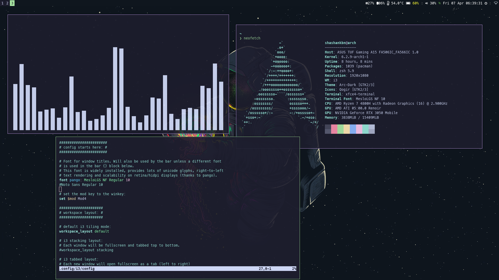
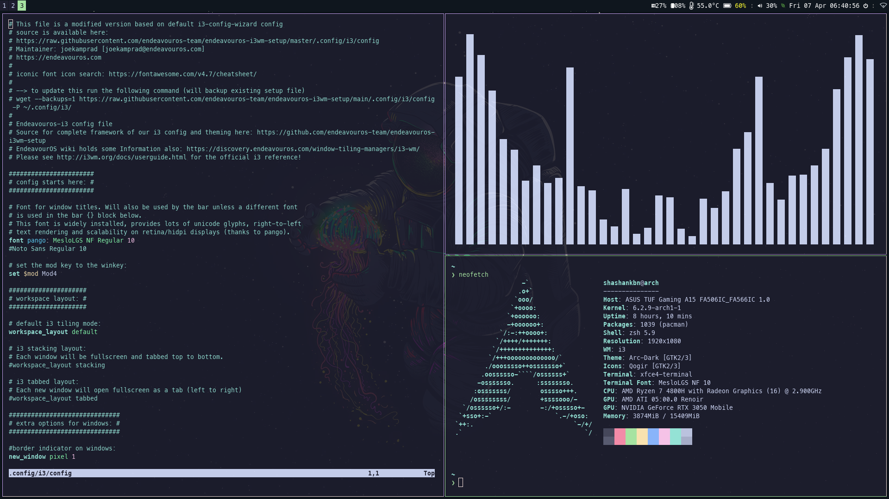

# Dotfiles
## Using gruvbox now. Didnt change README yet. Will change in the future. (If still not done , ping me)
These are my i3wm setup. It uses catppuccin colorscheme. The terminal is zsh with starship theme/ zsh with default robbyrussell theme. Helpful as it shows untracked, uncommited and push status and also which branch I am in right in the terminal. Pretty nifty and useful. Here are some screenshots. 

This is using catppuccin theme in a subdued manner. 
There is also my alacritty config. Alacritty is a cross platform terminal with hardware exceleration and written in rust. 
